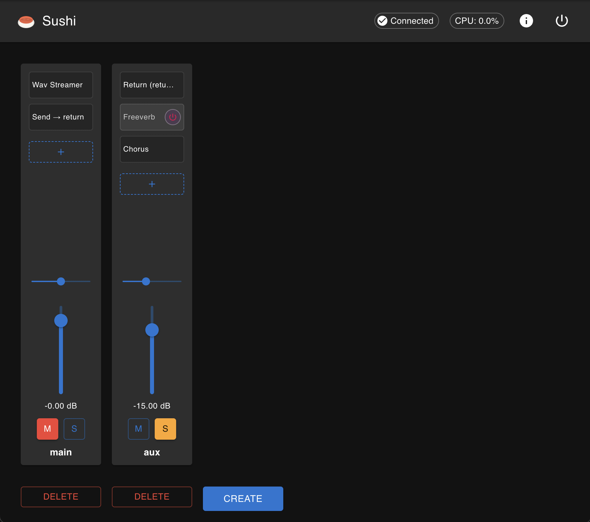
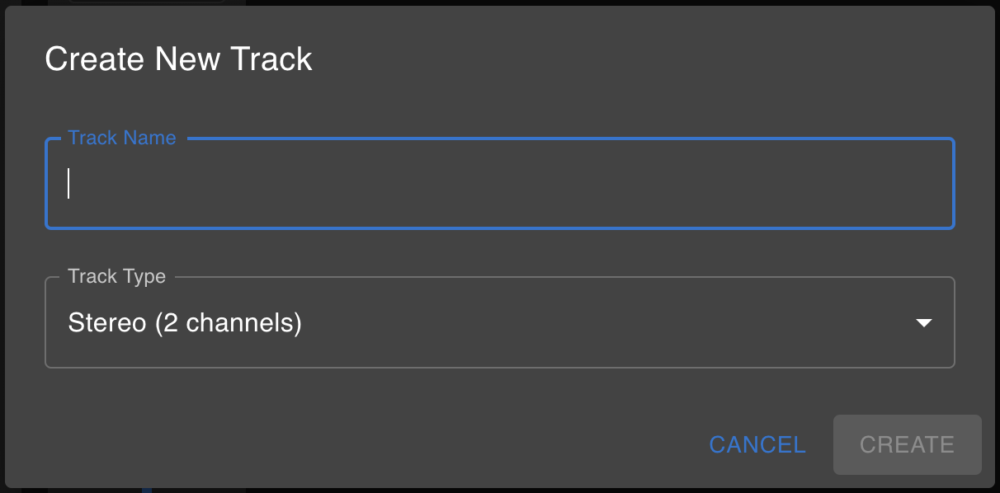
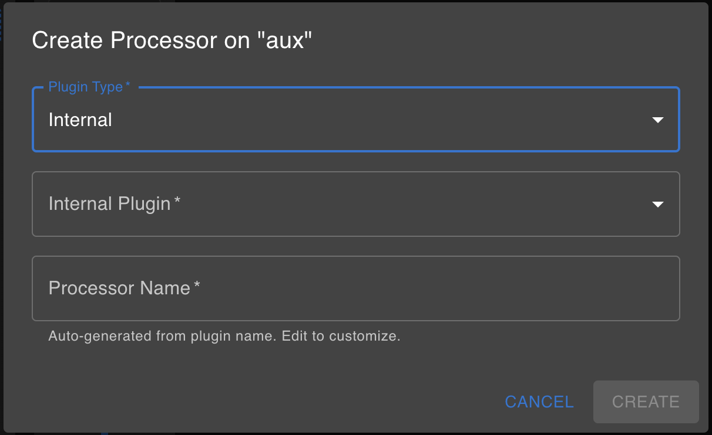
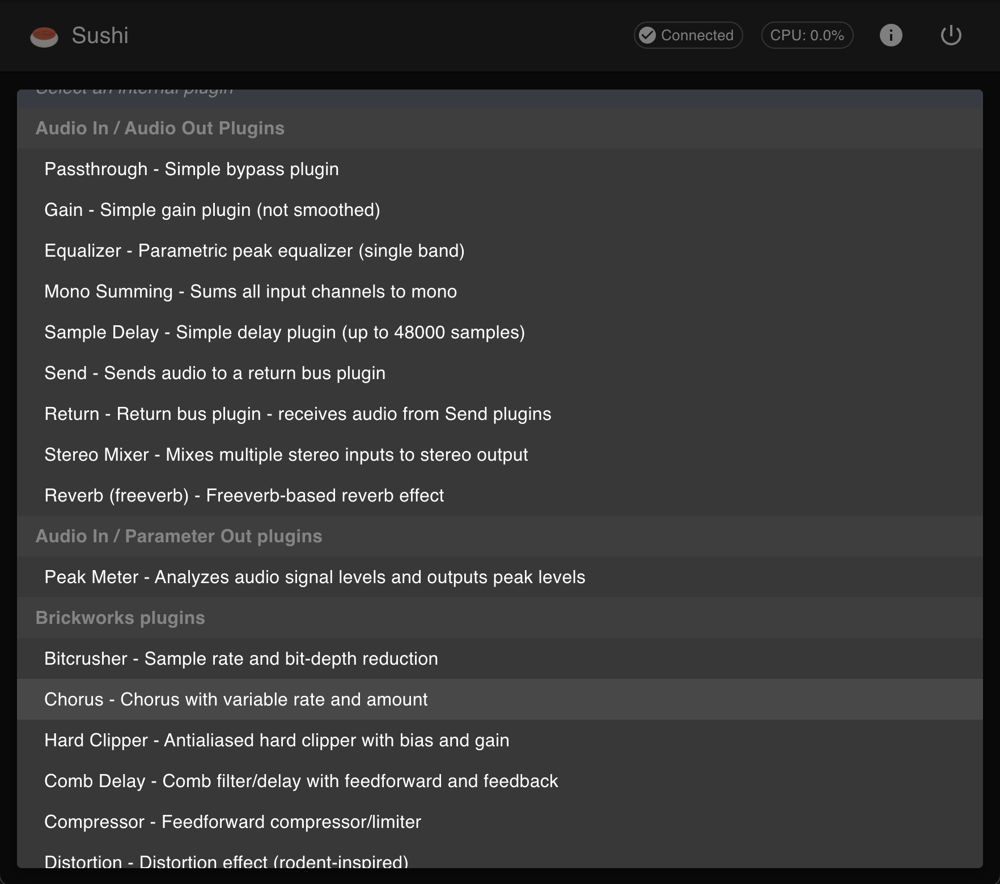
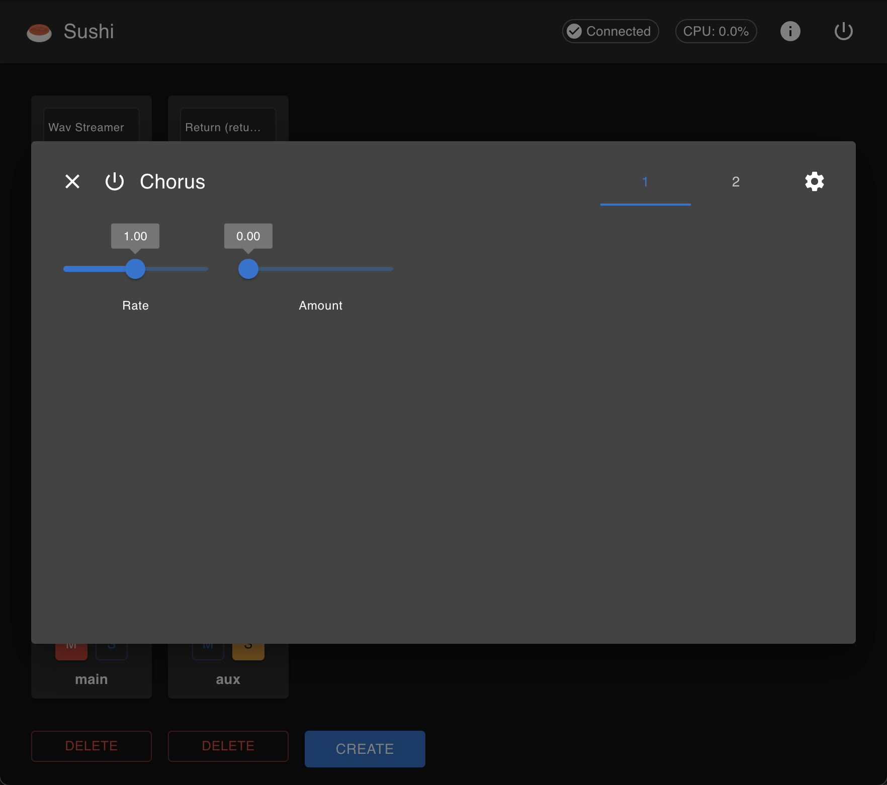
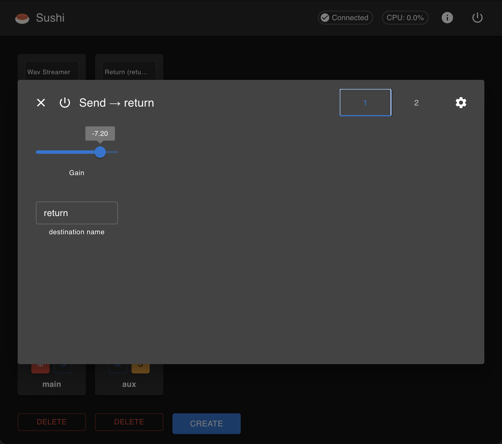
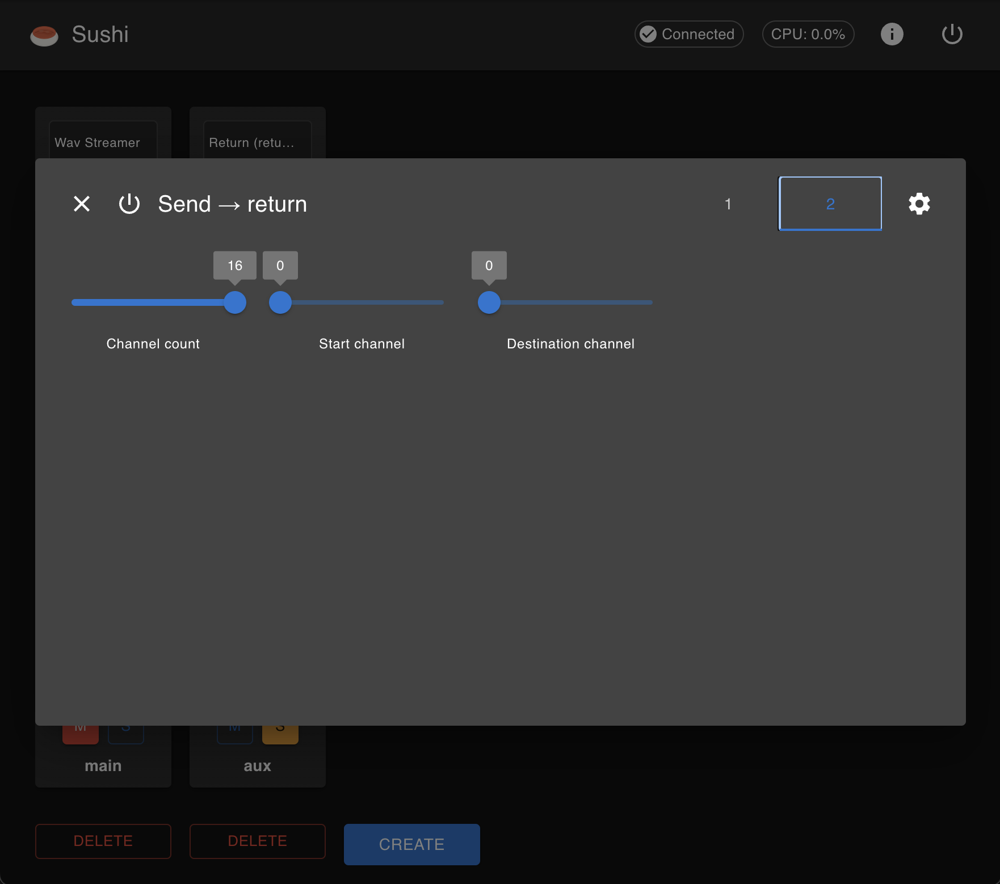
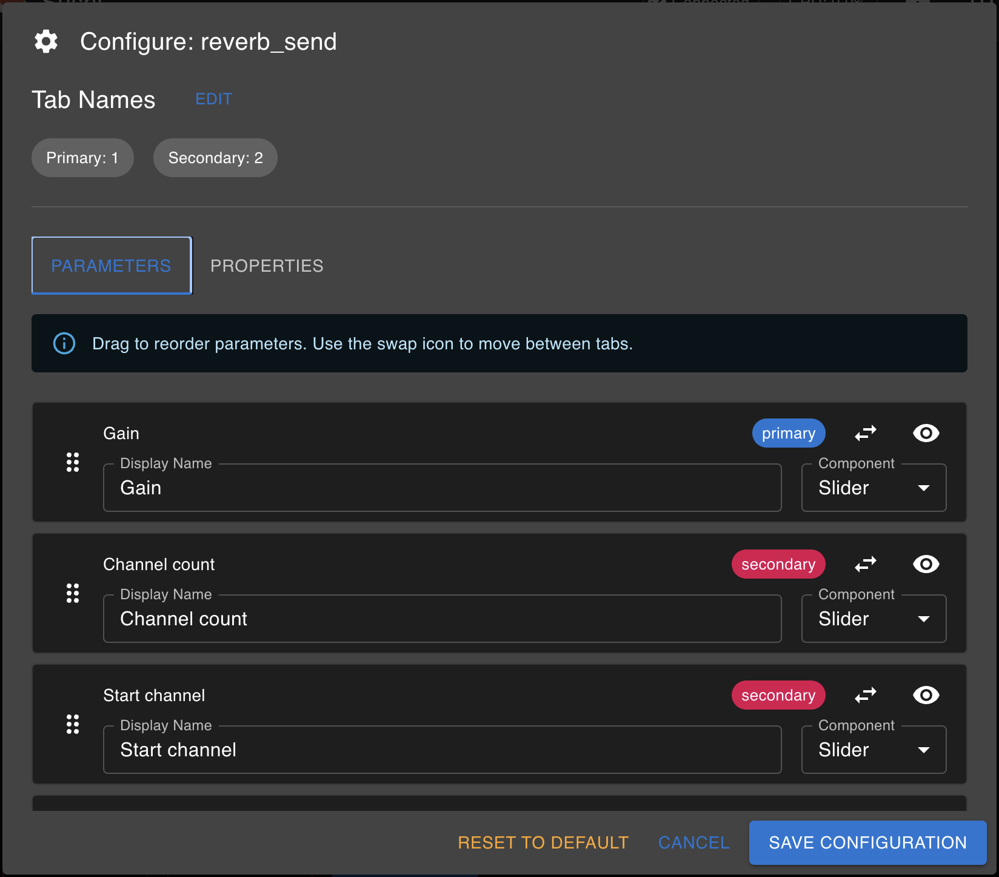

# Sushi Web UI

A modern web-based user interface for controlling Sushi (Elk Audio OS) via gRPC-Web. Built with React, TypeScript, Vite, and Material-UI.

## About This Project

This project represents my first complete pure "vibe coding" experiment. The goal was to measure whether AI-assisted development could make me 10x more productive. The answer is definitively yes, though it requires full supervision and careful guidance of the AI to produce exactly what's needed and fix bugs as they arise.

Built entirely using Windsurf with Claude Sonnet 4, completed over two weekend evenings. **I wrote 0 lines of code myself** - everything was generated through natural language conversations with the AI, from initial setup to final deployment.

**Development Cost**: Used 207 Windsurf credits (approximately $6) for the entire project, including initial development, debugging, UI refinements, and final deployment setup.

## Screenshots

### Main Mixer Interface

*The main mixer interface showing two tracks (main and aux) with processors, volume faders, and mute/solo controls. The toolbar displays connection status, CPU usage, and collapsible system info.*

### Track Creation

*Creating a new track with configurable name and channel count (mono/stereo).*

### Processor Creation

*Adding processors to tracks with support for internal plugins, VST plugins, and Brickworks effects.*

### Plugin Selection

*Comprehensive plugin browser showing available internal plugins, audio I/O processors, and Brickworks effects with detailed descriptions.*

### Parameter Control Dialog

*Real-time parameter editing interface with sliders, numeric input, and bypass controls.*

### Parameter Tabs - Primary Controls

*Primary parameter controls showing main effect parameters with real-time updates.*

### Parameter Tabs - Secondary Controls  

*Secondary parameter controls for advanced effect configuration.*

### Parameter Configuration Editor

*Advanced parameter configuration interface allowing customization of display names, UI components, and parameter organization with drag-and-drop reordering.*

## Features

- **Real-time Connection**: Connect to Sushi via gRPC-Web proxy
- **System Monitoring**: Display Sushi version, CPU load, track count, and processor count
- **Mixer Interface**: Classic DAW-style mixer with vertical track channels
- **Live Updates**: Real-time parameter updates via gRPC notifications
- **Responsive Design**: Modern dark theme with Material-UI components

## Prerequisites

- Node.js 18+ and npm
- A running Sushi instance
- A gRPC-Web proxy (e.g., Envoy) configured to proxy requests to Sushi's gRPC port

## Installation

1. Clone the repository with submodules:
```bash
git clone --recursive <your-repo-url>
cd sushi-web-ui
```

2. Install dependencies:
```bash
npm install
```

3. The TypeScript bindings for the gRPC API will be automatically generated during installation.

## Development

Start the development server:
```bash
npm run dev
```

The application will be available at `http://localhost:5173`.

## Building for Production

```bash
npm run build
```

The built files will be in the `dist/` directory.

## Project Structure

```
src/
├── components/          # React components
│   ├── ConnectionDialog.tsx    # Connection setup dialog
│   ├── Toolbar.tsx            # Top toolbar with system info
│   ├── TrackChannel.tsx       # Individual track mixer channel
│   └── MixerView.tsx          # Main mixer interface
├── contexts/           # React contexts
│   └── SushiContext.tsx       # Main Sushi gRPC state management
├── generated/          # Auto-generated TypeScript bindings
│   ├── sushi_rpc.ts           # Generated from sushi_rpc.proto
│   └── api_version.ts         # Generated from api_version.proto
└── App.tsx            # Main application component
```

## Usage

1. Start your Sushi instance
2. Start the gRPC-Web proxy (e.g., Envoy)
3. Open the web UI and enter the proxy URL (e.g., `http://localhost:8080`)
4. Click "Connect" to establish the connection
5. The mixer interface will display all available tracks with their processors and parameters

## API Integration

The application uses the official Sushi gRPC API via the `sushi-grpc-api` submodule. Key controllers used:

- **AudioGraphController**: Track and processor management
- **ParameterController**: Parameter querying and control
- **SystemController**: System information
- **NotificationController**: Real-time updates
    },
  },
])
```
